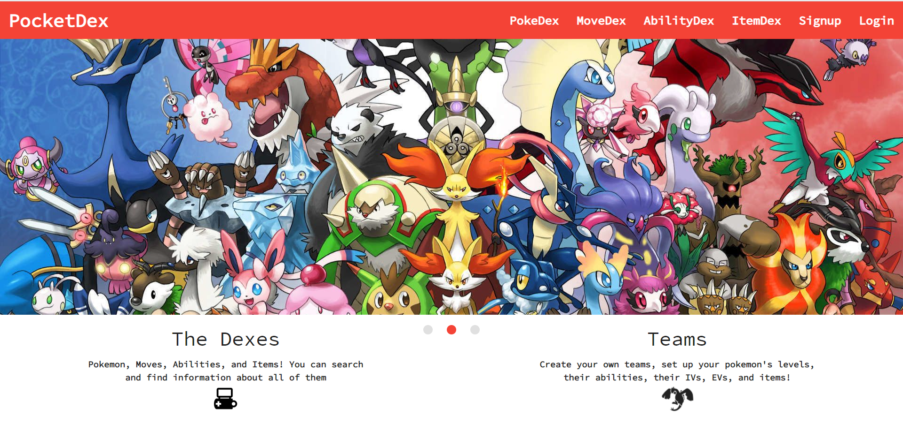
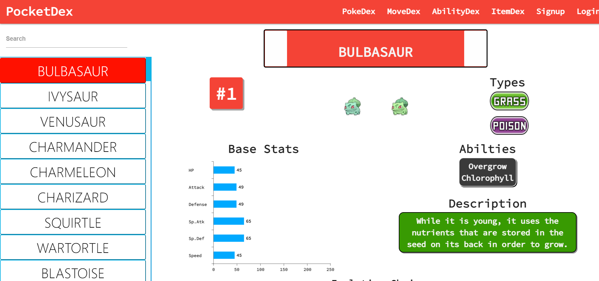
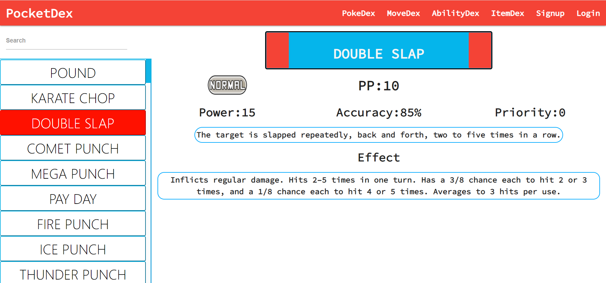
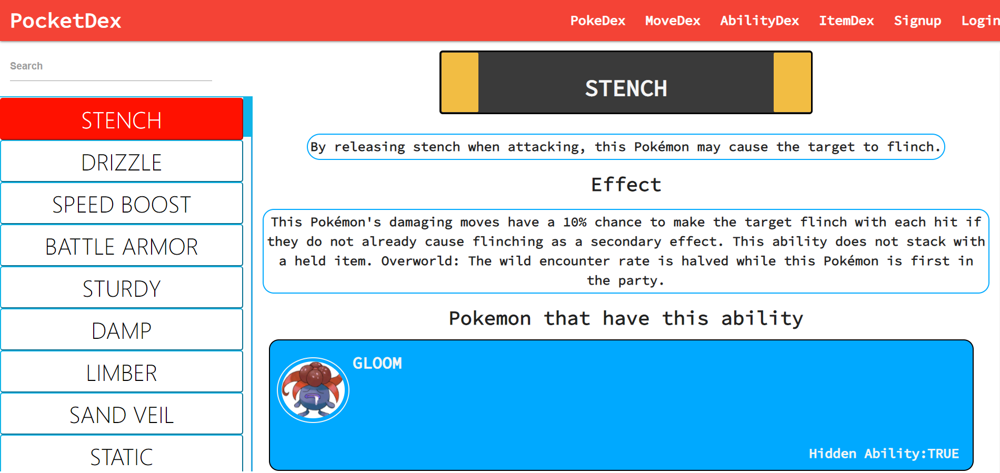
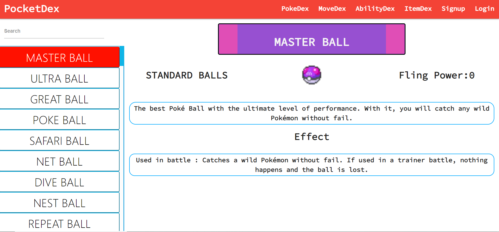
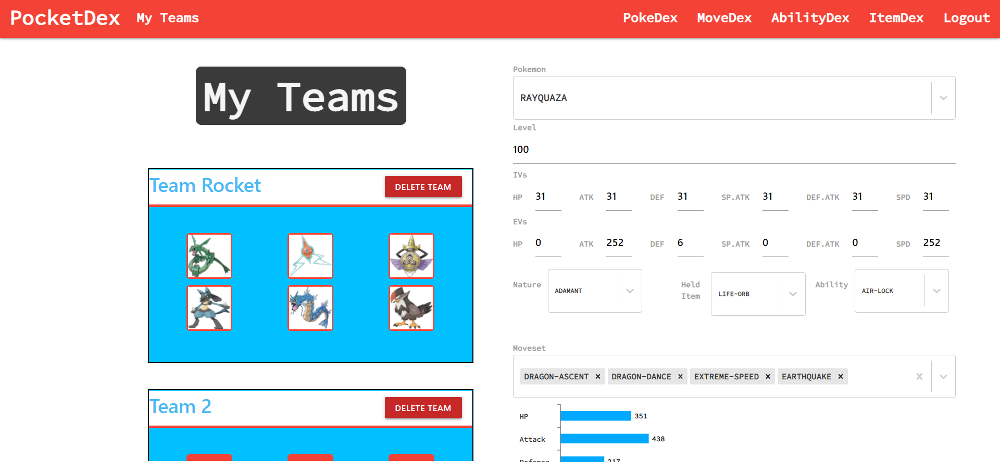

# PocketDex

## About

This is a pokemon database appliation that can be used to look at information about certain pokemon, moves, abilities and items. You can make an account, build teams, calculate stats, and damage towards other pokemon. Its an application meant to make it easier to plan out your teams.

## The Dexes

All of the information about the pokemon, moves, abilities, and items come straight from the [pokeAPI](https://pokeapi.co/)

### PokeDex

You can search up information about pokemon from the search bar and get all sorts of data such as type, base stats, moveset, evolution line, alternate forms, and pokedex flavor text.

### MoveDex

You can search up information about the moves that pokemon can use and get data like type, power, accuracy, move priority, amount of PPs, in-game description, and in-depth effect.

### AbilityDex

You can search up info about the abilities that pokemon could have and get information like in-game description, the in-depth effect, and even the pokemon that can learn it.

### ItemDex

You could also search for items, consumables, held items, berries, any of them and get stuff like fling power, in-game description and in-depth effect.

## Building Teams

If you sign up you may create your own teams. You will be able to add new ones, remove some, rename them and put in pokemon that you are planning on building by adjusting level, IVs, EVs, nature, ability, and held item. There will be a small display that will show the current stats of the pokemon in real time.

